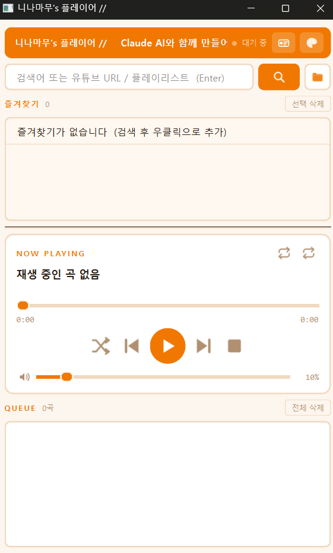

<div align="center">


# 니나마무's 플레이어

**치지직 스트리머를 위한 유튜브 뮤직 플레이어**

[](https://github.com/LEESIHEON1213/CHZZK_MUSIC_PLAYER/releases/latest)
[](https://python.org)
[](LICENSE)
[](https://github.com/LEESIHEON1213/CHZZK_MUSIC_PLAYER/releases)

<br/>

<!-- 스크린샷: assets/screenshot.png 로 교체 -->


<br/><br/>

**[⬇ exe 다운로드](https://github.com/LEESIHEON1213/CHZZK_MUSIC_PLAYER/releases/latest)** &nbsp;·&nbsp;
**[사용법 보기](#-사용법)** &nbsp;·&nbsp;
**[문제 신고](https://github.com/LEESIHEON1213/CHZZK_MUSIC_PLAYER/issues)**

</div>

---

## ✨ 주요 기능

| 기능 | 설명 |
|---|---|
| 🔍 **유튜브 검색 / URL 재생** | 키워드 검색 또는 유튜브 링크 직접 붙여넣기 |
| 📋 **재생 큐** | 드래그로 순서 변경, 우클릭 컨텍스트 메뉴 |
| ⭐ **즐겨찾기** | 곡·플레이리스트·검색어 저장, 재시작 후에도 유지 |
| 🎨 **8가지 테마** | 니나마무 / 미드나잇 / 오션 / 로즈 / 포레스트 / 모노크롬 / 라이트 + 커스텀 |
| 🔁 **반복 / 셔플** | 한 곡 반복 · 전체 반복 · 셔플 |
| 📺 **OBS 캡처 지원** | 창 캡처 후 크로마키 or 자르기 필터로 방송에 삽입 |
| 🔧 **자동 업데이트** | yt-dlp · ffmpeg 최신 버전 자동 감지 및 업데이트 |
| 🖥️ **위젯 모드** | 최소화된 미니 위젯으로 OBS 소스 활용 |

---

## ⬇ 설치

### 방법 A — exe 바로 실행 (권장)

1. [Releases](https://github.com/LEESIHEON1213/CHZZK_MUSIC_PLAYER/releases/latest) 에서 `NinamamuPlayer.exe` 다운로드
2. 원하는 폴더에 놓고 실행
3. 최초 실행 시 yt-dlp · ffmpeg 자동 다운로드

### 방법 B — 소스 실행

```bash
git clone https://github.com/YOUR_ID/YOUR_REPO.git
cd YOUR_REPO
pip install -r requirements.txt
python main.py
```

> **Python 3.11 이상** 필요

---

## 🎬 사용법

| 동작 | 방법 |
|---|---|
| 유튜브 검색 | 검색창에 키워드 입력 → Enter |
| URL 직접 재생 | 유튜브 URL 붙여넣기 → Enter |
| 검색 결과 재생 | 결과 항목 더블클릭 |
| 로컬 파일 추가 | 📁 버튼 클릭 또는 창에 드래그앤드롭 |
| 큐 조작 | 항목 우클릭 → 지금 재생 / 제거 |
| 즐겨찾기 추가 | 재생 중 ⭐ 버튼 또는 큐 우클릭 |
| 볼륨 | 하단 슬라이더 (재시작 후에도 유지) |

---

## 📺 OBS 연동

```
1. OBS → 소스 추가 → 창 캡처
2. 창: [NinamamuPlayer.exe]
3. 필터 → 자르기/패딩으로 원하는 영역만 잘라내기
4. (선택) 색상 키 필터로 배경 제거
```

---

## 🗂 프로젝트 구조

```
NinamamuPlayer/
├── main.py          # 진입점
├── paths.py         # 경로 중앙 관리 (Nuitka onefile 대응)
├── ui.py            # 메인 UI (PyQt6)
├── player.py        # 재생 엔진 (yt-dlp + ffplay)
├── theme.py         # 테마 시스템
├── widget.py        # 위젯 모드
├── updater.py       # yt-dlp / ffmpeg 자동 업데이트
├── icons.py         # SVG 아이콘
├── build.bat        # Nuitka 빌드 스크립트
└── requirements.txt
```

---

## 🔨 빌드

```bash
pip install nuitka
build.bat
# dist/NinamamuPlayer.exe 생성
```

---

## 🐛 트러블슈팅

**소리가 안 나요**
→ ffplay가 없거나 업데이트가 실패한 경우입니다. `cache/` 폴더를 삭제 후 재시작하면 재다운로드됩니다.

**유튜브 검색이 안 돼요**
→ yt-dlp가 차단된 경우입니다. 앱 재시작 시 자동으로 최신 버전으로 업데이트됩니다.

**빌드가 안 돼요**
→ `pip install nuitka` 후 `build.bat` 실행. Python 3.11 이상 필요.

---

## 📄 라이선스

MIT License · 자유롭게 사용, 수정, 배포 가능

---

<div align="center">
  <sub>Made with ❤️ for 치지직 스트리머</sub>
</div>
